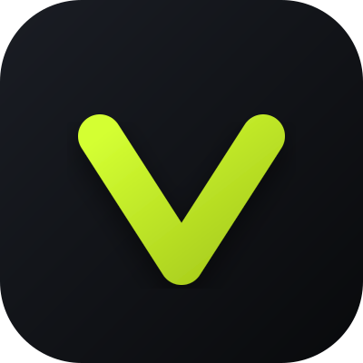
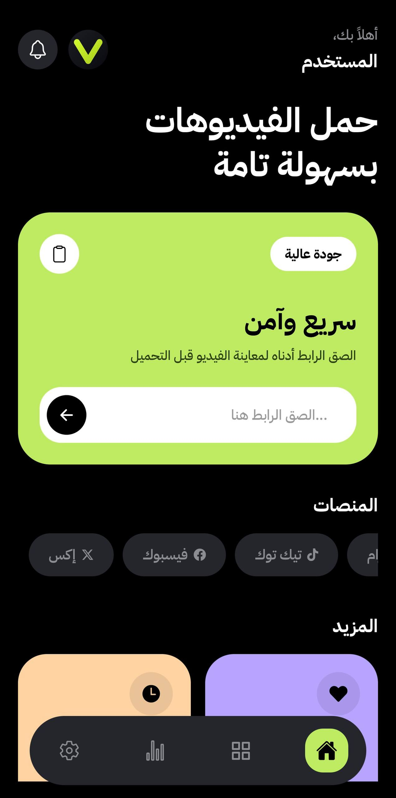
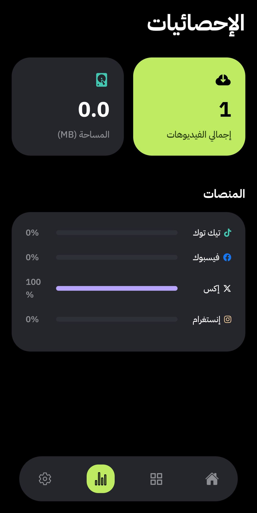
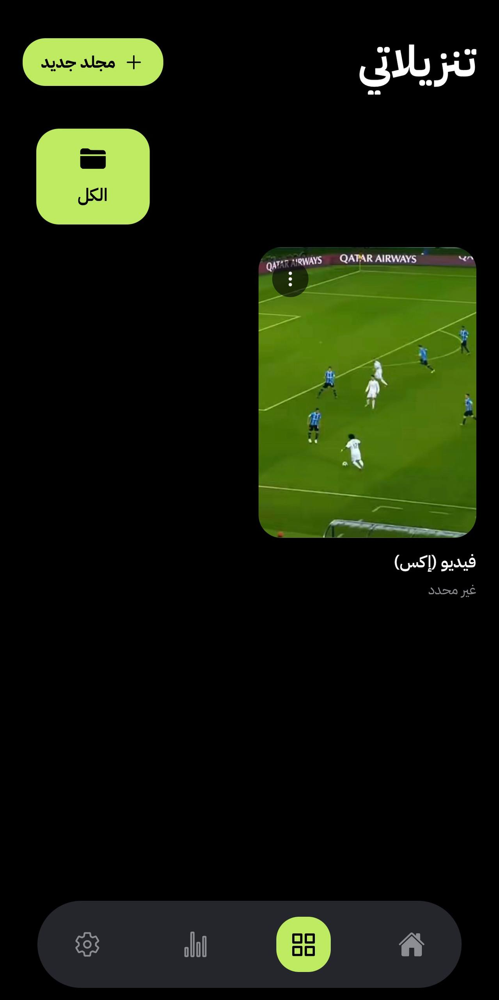

<div align="center">
  
  
  # Vexa DL
  
  **The Ultimate Universal Media Downloader App** 🚀
  
  [](https://reactnative.dev/)
  [](https://expo.dev/)
  [](https://www.typescriptlang.org/)
  
  *قم بتحميل الفيديوهات والصور من منصاتك المفضلة بضغطة زر واحدة، وبأعلى جودة ممكنة!*
</div>

---

## ✨ المميزات (Features)
- 🚀 **تحميل فائق السرعة**: حمل الفيديوهات والصور مباشرة إلى معرض هاتفك.
- 🎯 **تعرف ذكي على الروابط**: يتعرف التطبيق تلقائياً على المنصة بمجرد لصق الرابط.
- 📊 **إحصائيات متقدمة**: تتبع نشاط تحميلاتك من مختلف المنصات من خلال واجهة رسومية تفاعلية.
- 🔔 **إشعارات محلية (Local Notifications)**: تنبيهات فورية عند اكتمال التحميل.
- 📁 **إدارة التنزيلات**: سجل كامل لكل ما قمت بتحميله مع إمكانية الوصول السريع.
- 🎨 **واجهة مستخدم عصرية**: تصميم أنيق مع رسومات بيانية ديناميكية، الوضع الليلي الأنيق، وسلاسة في الاستخدام.

---

## 🌍 المنصات المدعومة (Supported Platforms)
| المنصة | الدعم |
|:---|:---:|
| **Instagram** (إنستغرام) | ✅ مدعوم بالكامل (Reels, Posts) |
| **X / Twitter** (إكس) | ✅ مدعوم بالكامل |
| **TikTok** (تيك توك) | ✅ مدعوم بالكامل |
| **Facebook** (فيسبوك) | ✅ مدعوم |

*(ملاحظة: تم إزالة دعم YouTube التزاماً بسياسات المنصة وحقوق الطبع والنشر).*

---

## 📸 لقطات الشاشة (Screenshots)

<div align="center">
  
  
  
  
</div>


---

## 🛠️ التقنيات المستخدمة (Tech Stack)
- **Framework:** [React Native](https://reactnative.dev/) with [Expo](https://expo.dev/)
- **Language:** TypeScript
- **DOM Scraping & Injection:** `react-native-webview`
- **Storage:** `expo-media-library` (للحفظ في المعرض) & `AsyncStorage` (لإدارة السجل)
- **Notifications:** `expo-notifications`
- **Icons:** `@expo/vector-icons` (FontAwesome5 & FontAwesome6)

---

## 🚀 طريقة التشغيل (Installation)

1. **استنساخ المستودع (Clone the repo):**
   ```bash
   git clone https://github.com/iislam-x7/vexa-dl.git
   cd vexa-dl
   ```

2. **تثبيت الحزم (Install dependencies):**
   ```bash
   npm install
   ```

3. **تشغيل التطبيق (Start the app):**
   ```bash
   npx expo start -c
   ```
   > استخدم تطبيق **Expo Go** على هاتفك لمسح رمز الاستجابة السريعة (QR Code) وتجربة التطبيق، أو يمكنك عمل `Development Build`.

---

## ⚠️ تنويه قانوني (Disclaimer)
هذا التطبيق مصمم للأغراض الشخصية فقط. يرجى احترام حقوق الطبع والنشر للمحتوى الذي تقوم بتنزيله والتأكد من حصولك على الأذونات اللازمة من صُناع المحتوى الأصليين. المطور غير مسؤول عن أي سوء استخدام للأداة.

---

## 👨‍💻 المطور (Author)
صُنع بحب بواسطة **Islam** 💚

- **إكس (تويتر):** [@iislam_x7](https://x.com/iislam_x7)
- **إنستغرام:** [@iislam_x7](https://instagram.com/iislam_x7)

إذا أعجبك التطبيق لا تنسَ إعطاء المستودع ⭐️ لدعم المشروع!
